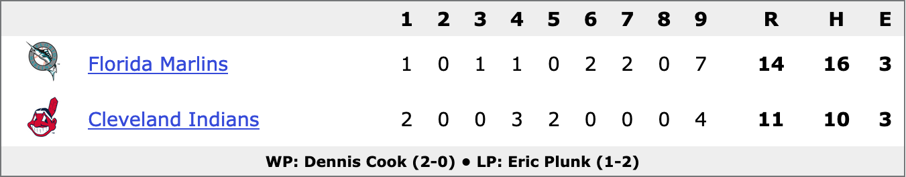

Title: About
Date: 2000-01-01 00:00

# About the 1997 World Series

## Game 3 Final Score

## Videos

[Game 1](https://www.youtube.com/watch?v=_HxdCvXNBdU&list=PL70atU5j73JJFBRq5f8oSOfg5OAgisdZm&index=2)

[Game 2](https://www.youtube.com/watch?v=Wr8ZaxmJjGI&list=PL70atU5j73JJFBRq5f8oSOfg5OAgisdZm&index=3)

[Game 3](https://www.youtube.com/watch?v=nokOChRgBhQ&list=PL70atU5j73JJFBRq5f8oSOfg5OAgisdZm&index=4)

[Game 4](https://www.youtube.com/watch?v=GOIItZEchEw&list=PL70atU5j73JJFBRq5f8oSOfg5OAgisdZm&index=5)

[Game 5](https://www.youtube.com/watch?v=e_gG7H5omu8&list=PL70atU5j73JJFBRq5f8oSOfg5OAgisdZm&index=6)

[Game 6](https://www.youtube.com/watch?v=fzOj2wMnlIc&list=PL70atU5j73JJFBRq5f8oSOfg5OAgisdZm&index=7)

[Game 7](https://www.youtube.com/watch?v=PJ-BhS0CFgs&list=PL70atU5j73JJFBRq5f8oSOfg5OAgisdZm&index=8)

[Playlist of all 7 games](https://www.youtube.com/playlist?list=PL70atU5j73JJFBRq5f8oSOfg5OAgisdZm)

## Links

### 1997 World Series

[1997 World Series @ Wikipedia](https://en.wikipedia.org/wiki/1997_World_Series)

[1997 World Series @ baseball-reference.com](https://www.baseball-reference.com/postseason/1997_WS.shtml)

[1997 World Series @ baseball-almanac.com](https://www.baseball-almanac.com/ws/yr1997ws.shtml)

### Game 3

[Game 3 @ baseball-reference.com](https://www.baseball-reference.com/boxes/CLE/CLE199710210.shtml)

[Game 3 @ baseball-almanac.com](https://www.baseball-almanac.com/box-scores/boxscore.php?boxid=199710210CLE)

### Teams

[1997 Florida Marlins Roster @ baseball-almanac.com](https://www.baseball-almanac.com/teamstats/roster.php?y=1997&t=FLO)

[1997 Cleveland Indians Roster @ baseball-almanac.com](https://www.baseball-almanac.com/teamstats/roster.php?y=1997&t=CLE)

### Out of the Park Baseball Simulator

[Out of the Park Baseball](https://www.ootpdevelopments.com/out-of-the-park-baseball-home/)

